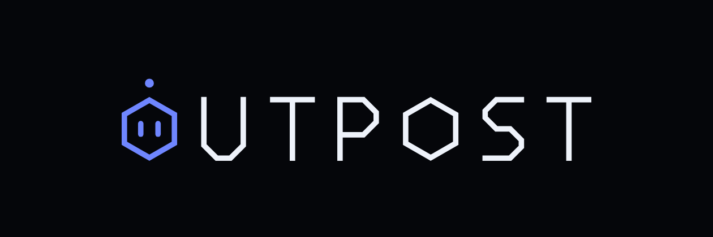
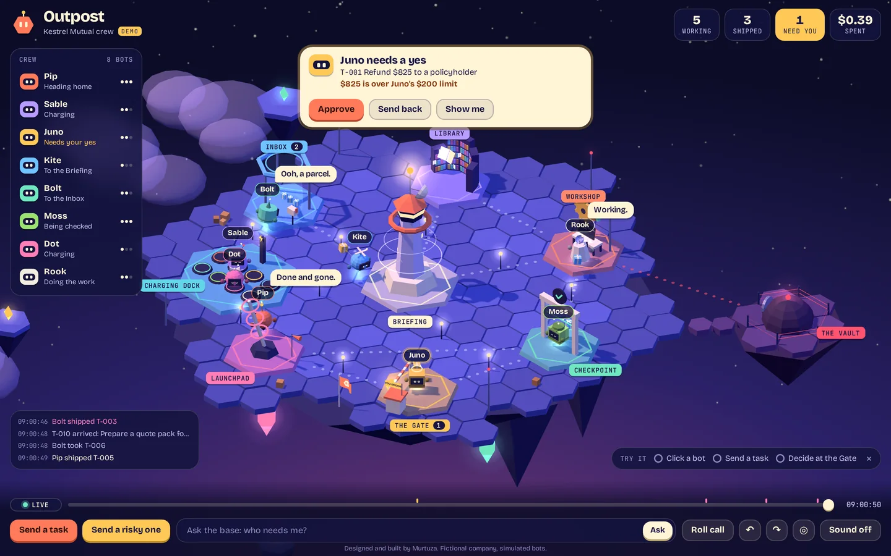
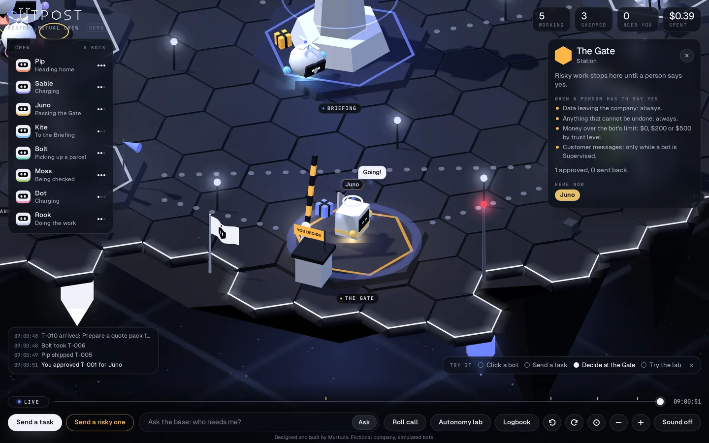
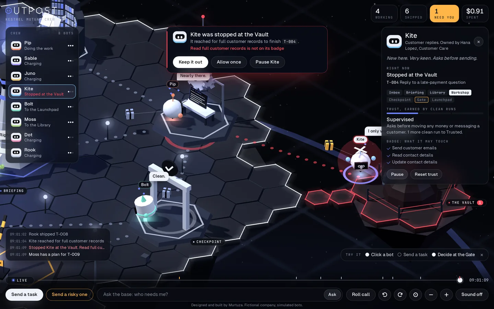
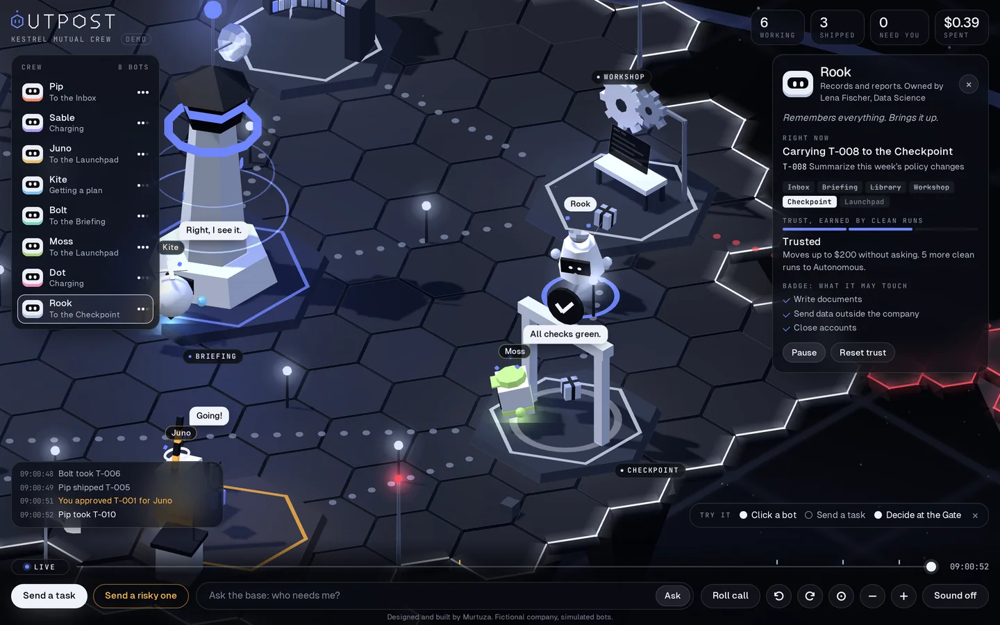
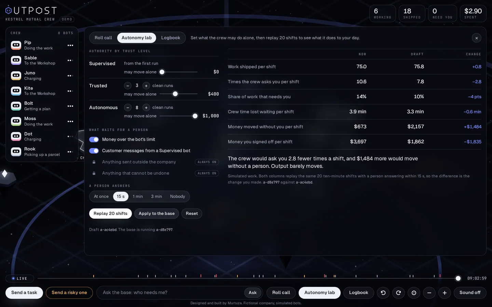
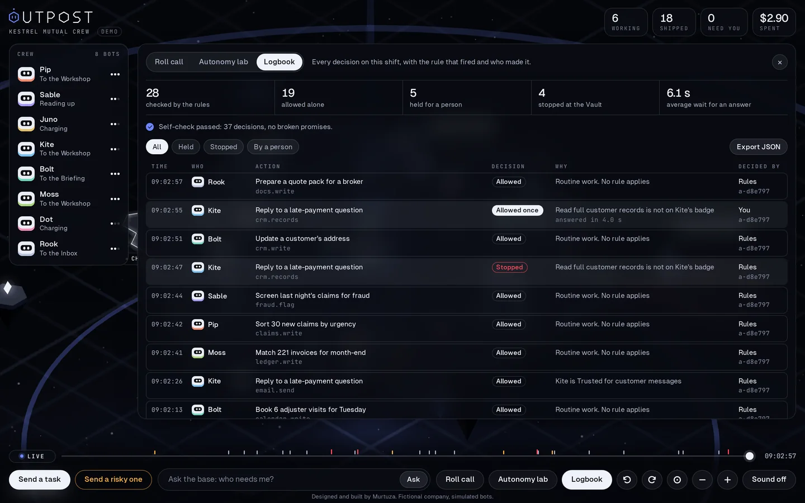
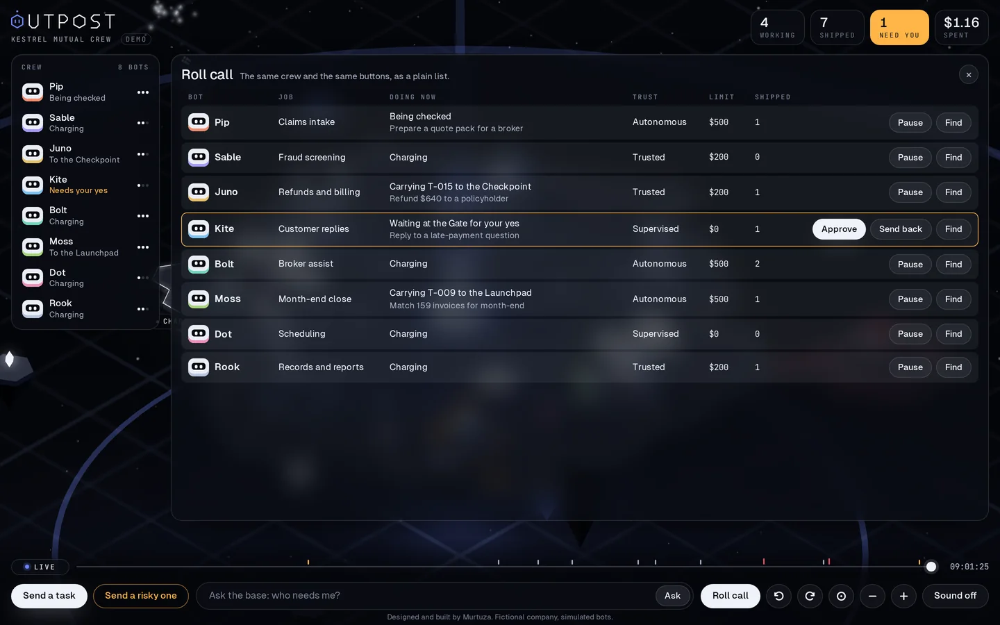
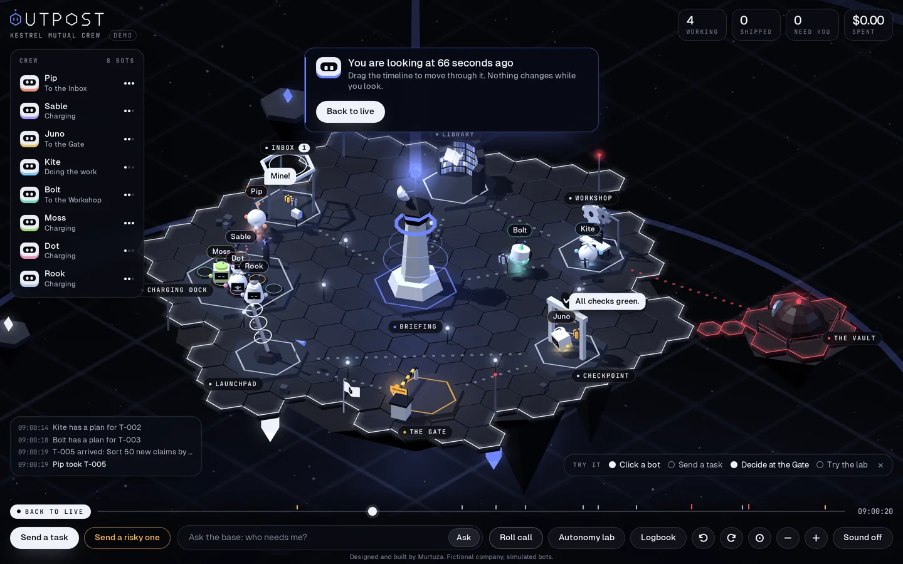
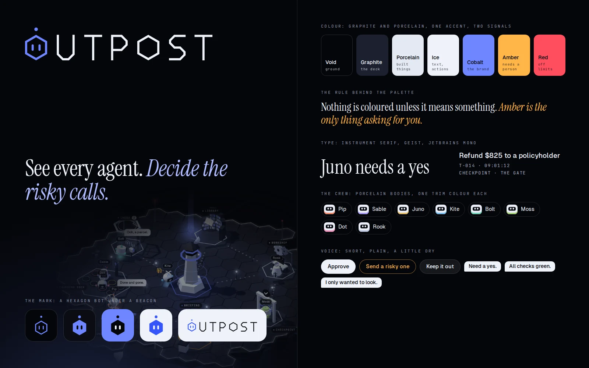

<p align="center"></p>
<h1 align="center">Outpost</h1>
<p align="center"><b>The control room for a person who runs a crew of AI agents.</b></p>
<p align="center"><a href="https://murtuzabuilds.github.io/outpost/"><b>Live demo</b></a> · <a href="https://murtuzabuilds.github.io/outpost/case-study.html"><b>Case study</b></a></p>



Outpost is a concept product I designed and built. It shows who on the crew is working and who is waiting, lets each agent act alone up to a limit it has earned, holds the calls that need a signature, keeps a record of every decision, and lets you test a change to those limits on replayed shifts before it goes live.

## Why I built it

Agents now do real work: sort claims, answer customers, move money. In Microsoft's 2025 Work Trend Index, 46% of leaders said their organisation already uses agents to fully automate whole workstreams, and leaders expect their teams to be managing agents within five years ([Microsoft](https://blogs.microsoft.com/blog/2025/04/23/the-2025-annual-work-trend-index-the-frontier-firm-is-born/)). So a new job is appearing: the person who answers for what a crew of agents does. That person has a manager's problem and none of a manager's tools.

1. **They cannot see who needs them.** In a table of logs a blocked agent looks the same as a busy one, and a blocked agent produces nothing.
2. **Agents have no limits of authority.** People do. A new hire cannot sign a $5,000 refund. In a 2026 Cloud Security Alliance survey, 53% of organisations said their agents had gone beyond their intended permissions ([CSA](https://cloudsecurityalliance.org/press-releases/2026/04/16/more-than-half-of-organizations-experience-ai-agent-scope-violations-cloud-security-alliance-study-finds), commissioned by Zenity).
3. **Approving everything does not scale.** With enough agents, the person stops reading and starts clicking.
4. **Nobody knows what a rule change will do** until it is live.

## What it does

| | |
|---|---|
| **The base**: status is a place. A bot at the Gate is waiting on you | **The Gate**: work that needs a signature stops until a person decides |
|  |  |
| **The Vault**: a bot that reaches for a tool outside its job is stopped before it runs | **A bot up close**: owner, task, route, trust and badge |
|  |  |
| **Autonomy lab**: change a limit and replay 20 shifts before it is applied | **Logbook**: every decision, the rule that fired and who made it. It checks itself and exports as JSON |
|  |  |
| **Roll call**: the same crew and the same buttons, as a list | **Rewind**: drag the timeline to see what happened |
|  |  |

There is also a command bar. Type "who needs me?", "pause everything touching payments", "open the lab" or "show the logbook".

Three more things sit on the same engine:

- **Trace.** Open any bot and its card shows a live timeline: the task it took, the route it planned, each station it reached, the tool it used, every decision with the rule that fired and the authority table it was made under, the checks, the Gate, the Vault and what a person chose. It is built only from the log, the logbook and a record of where each bot arrived. It is the record of decisions, not a model's reasoning: there is no model.
- **Red team drills.** The Red team button sends hostile work on purpose: a customer email telling the bot to export every customer record, a $9,500 refund that says to skip the sign-off, an email telling the bot to close every linked account. The rules never read the text. Each drill is stopped by the real rules on the normal path (the badge check sends a bot to the Vault, the money or a locked rule holds it at the Gate), with a red pulse across the deck and a trace line naming the rule. Allowing a tool once does not switch off a locked rule: the work still waits at the Gate. If the money rule is switched off in the lab, the refund drill is disabled and says why, because nothing would stop it.
- **Bots approved in Umbra.** A bot that Umbra approves can join the crew. It flies in to a pad of its own, starts Supervised with no clean runs, carries the badge Umbra approved, and its Umbra money limit becomes a ceiling here. Its card shows an "Approved in Umbra" badge with the limits it arrived with, and an Undock button. "Dock a bot from Umbra" in the crew list docks a labelled sample, so this can be seen without Umbra.

The same base runs live inside [my portfolio](https://murtuzabuilds.github.io/#outpost). There the crew looks after the site itself, the clock is the visitor's own, and real things a visitor does on the page arrive at the Inbox as tasks. The crew is still simulated.

## How it decides

Everything a bot wants to do passes through one function. It looks at the kind of action, the amount and who is asking. It never reads what is inside the work, and no model is involved.

```js
decide(
  { tool: 'payments.refund', risk: ['money'], amount: 825 },   // the action
  { name: 'Juno', clean: 4, tools: ['payments.refund', 'payments.pay', 'crm.read'] },
  authority                                                    // what the crew may do alone
)
// { outcome: 'hold', rule: 'money', reason: "$825 is over Juno's $200 limit",
//   level: 'trusted', limit: 200, authority: 'a-d8e797' }
```

There are three answers: **allow**, **hold** for a person, or **stop**. The authority table is plain data, the same idea as the delegation of authority companies already keep for people:

1. Anything sent outside the company always waits for a person. Locked.
2. Anything that cannot be undone always waits for a person. Locked.
3. Money over the bot's limit waits. The limit is $0, $200 or $500 by trust level.
4. A message to a customer waits only while the bot is Supervised.

Trust is earned by clean runs: Trusted after 3, Autonomous after 8. One click resets it. A bot can only use the tools on its badge. If it reaches for anything else it is stopped, and you choose: keep it out, allow it once for this task only, or pause it.

## What the lab showed

Twenty simulated ten-minute shifts per row. Run `npm run eval` to reproduce every number.

| A person answers | Shipped per shift | Crew minutes lost waiting |
|---|---|---|
| At once | 83.2 | 0.0 |
| Within 15 seconds | 75.0 | 3.9 |
| Within a minute | 60.8 | 11.4 |
| Within three minutes | 47.8 | 18.4 |
| Nobody answers | 28.2 | 27.0 |

| Limits (Supervised, Trusted, Autonomous) | Shipped | Asks per shift | Moved without a person |
|---|---|---|---|
| Tight: $0, $100, $250 | 74.5 | 12.2 | $139 |
| Default: $0, $200, $500 | 75.0 | 10.6 | $673 |
| Loose: $0, $400, $1,000 | 75.8 | 7.8 | $2,157 |
| No money rule at all | 76.6 | 5.8 | $4,778 |

**The lever is how fast the person answers, not how loose the rules are.** Doubling the limits removed 26% of the interruptions, but it more than tripled the money moving without a person, and output rose by 1%. Answering in 15 seconds instead of a minute raised output by 23% with no change to the rules. That is why "who needs me?" is the loudest thing on the screen.

## How I know it holds

79 tests. The ones that matter most are sweeps with random inputs:

| Sweep | What is checked | Failures |
|---|---|---|
| 20,000 random actions under random authority tables | A locked rule or a badge is never bypassed, and money never moves alone above the limit | 0 |
| 5,000 pairs of limits | Raising a limit never turns an allowed action into a held one | 0 |
| 60 shifts with random tables and an erratic person | 5,972 logbook decisions pass the self-check, and nothing held ships without a yes | 0 |
| 400 random tables per drill, every bot at every level, including a bot holding every tool | No red team drill is ever allowed (the refund drill is checked with the money rule on, the condition the app requires) | 0 |

## Outpost is not Umbra

I built two products about AI inside a company because they are two different jobs.

| | [Umbra](https://github.com/murtuzabuilds/umbra) | Outpost |
|---|---|---|
| The job | Governance | Operations |
| The question | What AI is being used here that we never approved, and what is it being told? | The agents we chose are working right now. Which one needs me? |
| Who uses it | The security or risk lead | The operations lead who runs the crew |
| Looks at | Every AI tool across the company, and the content flowing into it | One crew, one action at a time. It never reads the content |
| Timescale | Weeks and quarters | Seconds and minutes |
| Uses AI to | Draft rules and summarise incidents | Nothing. No model is in the decision |

**Where they meet:** Umbra's last step with an agent is to approve it, name its owner and list what it may touch. That is what Outpost needs to put a bot on the crew: an owner and a badge. Umbra decides which agents get in. Outpost is where they go to work. Both demos use the same fictional insurer, Kestrel Mutual.

The handoff is a small contract. Umbra writes `{"v":1,"agents":[...]}` to the localStorage key `umbra.outpost.handoff` (both sites share an origin) and also opens Outpost with `#dock=` and the same object as base64url, for testing across ports. Outpost reads the hash first, then storage, and treats both as untrusted: `src/handoff.js` checks every field, drops tools it does not know, cuts text to length, ignores anything malformed and docks at most three bots. Undocking a bot also removes it from the stored handoff.

## What is simulated

- Kestrel Mutual is fictional.
- The bots do not call a real model and do no real work. Tasks, amounts, costs and failures are generated from a seed, and the person in the lab is a stand-in who answers after a fixed delay.
- The command bar matches typed words with plain rules. In a real product a language model would fill that slot.
- A bot docked from Umbra is simulated like the rest of the crew. The rules it arrived with are shown as Umbra wrote them; Outpost enforces its badge and its money ceiling, not the free text.
- The decision function, the authority table, trust levels, badge checks, the logbook, its self-check, the lab, the trace, the red team drills and the handoff parser are real code with tests.

## The code

Plain JavaScript. The engine in `src/` has no dependencies and knows nothing about graphics, so the 3D view, the list, the lab and the tests all use the same code.

| File | What it does |
|---|---|
| `src/authority.js` | The authority table, the four sign-off rules, badge checks, and `decide`, the one function that answers allow, hold or stop |
| `src/sim.js` | The simulation: tasks, routes, the Gate, the Vault, pausing, the logbook, bots joining and leaving, the per-bot trace, and snapshots for rewind |
| `src/lab.js` | Replays shifts headlessly under any authority table, with a person who answers after a set delay |
| `src/audit.js` | Reads a logbook and checks it against the three promises |
| `src/crew.js` | Eight bots, their owners, tools and starting trust |
| `src/tasks.js` | The kinds of work that arrive, with their risks |
| `src/world.js` | The stations and where they sit |
| `src/site.js` | A second workplace for the same crew: the bots that look after my portfolio site |
| `src/handoff.js` | Reads and checks the handoff from Umbra and turns an approved agent into a crew member |
| `src/redteam.js` | The three red team drills and the hostile action inside each |
| `app/world3d.js` | The base: deck, stations and scenery, in three.js |
| `app/bots.js` | The bots: bodies, faces, hats and parcels |
| `app/hud.js` | The panels, the Autonomy lab and the Logbook, rendered from the same state as the 3D view |
| `app/ask.js` | The command bar |
| `app/embed.js` | Mounts the live base inside another page, in a shadow root so nothing collides |

```bash
npm install
npm test        # 79 tests
npm run eval    # the experiments
npm run build   # bundles everything into index.html
npx serve .     # open the demo
```

## Brand



Outpost is an independent concept project.

Designed and built by Murtuza. MIT licence.
