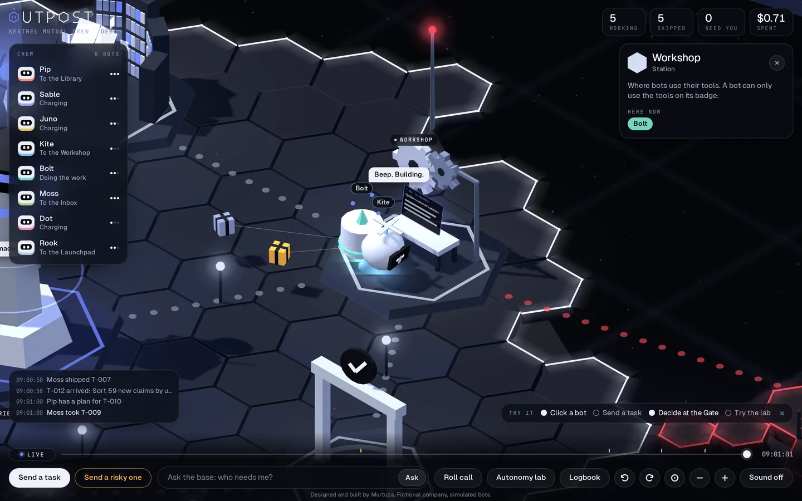

<p align="center"></p>
<h1 align="center">Outpost</h1>
<p align="center"><b>A base of operations for your AI agents. See the crew, set the limits, make the big calls yourself.</b></p>
<p align="center"><a href="https://murtuzabuilds.github.io/outpost/"><b>Live demo</b></a> · <a href="https://murtuzabuilds.github.io/outpost/case-study.html"><b>Case study</b></a></p>


Outpost is a concept product I designed and built. It is a place to manage a crew of AI agents, drawn as a small world you can look down on. Each bot is something you can click. Where it stands tells you what it is doing, and the risky calls stop and wait for you.

## Why I built it

Companies are starting to run agents that do real work: sort claims, send emails, move money. The tools for managing them are mostly tables and logs. That works for one agent. It gets hard when one person is responsible for a dozen, because the things that matter are easy to miss in a table: who is stuck, who is waiting on me, and who just reached for something they should not touch.

So the question I wanted to answer was a design one: **how does one person supervise a crew of agents?**

## The idea

Make the state of the crew a place.

| In the base | What it means |
|---|---|
| A bot towing a parcel between stations | An agent working through a task |
| The Gate, with its barrier down | Risky work is waiting for a person |
| The Vault, with a bot inside a red bubble | An agent reached for something that is not on its badge and was stopped |
| Pips circling a bot's head | Trust it has earned: Supervised, Trusted or Autonomous |
| The Charging Dock | Agents with nothing to do |

You can watch it, or you can run it: approve, send back, pause, reset trust, or let a bot into the Vault once.

## What is in the demo

| | |
|---|---|
| **The Gate**: a refund over the bot's limit waits for a yes | **The Vault**: a bot reaches for records it may not read |
|  |  |
| **A bot up close**: owner, task, route, trust and badge | **Roll call**: the same crew and the same buttons, as a list |
|  |  |
| **Rewind**: drag the timeline to see what happened | **The Workshop**: the bench screen shows the work being made |
|  |  |

There is also a command bar. Type "who needs me?", "where is Kite?" or "pause everything touching payments".

The same base also runs live inside [my portfolio](https://murtuzabuilds.github.io/#outpost). There the crew looks after the site itself, the clock is the visitor's own, and real things a visitor does on the page, like opening a project or asking a question, arrive at the Inbox as tasks. The crew is still simulated.

## The rules

When a person has to say yes is decided by four fixed rules, checked in this order. None of it is decided by a model.

1. Data leaving the company: always.
2. Anything that cannot be undone: always.
3. Money over the bot's limit. The limit is $0, $200 or $500, by trust level.
4. A message to a customer: only while the bot is Supervised.

Trust is earned by clean runs. A bot starts Supervised, becomes Trusted after 3 and Autonomous after 8. You can reset it with one click.

A bot can only use the tools on its badge. If it reaches for anything else, it is stopped, and you choose: keep it out, allow it once for this task only, or pause it.

## Results

Twenty simulated ten-minute shifts. Run `npm run eval` to reproduce.

| | Shipped per shift | Needed a person | Stopped at the Vault |
|---|---|---|---|
| Someone answering at once | 83.2 | 13.1 (16%) | 6.4 |
| Nobody answering | 28.2 | 3.0 still waiting at the end | |

Two things I take from this. Most work never needs a person, so the interface should stay quiet until it does. And when nobody answers, output drops by two thirds, because a waiting bot is a blocked bot. That is why "who needs me?" is the loudest thing on the screen.

## What is simulated

- The company, Kestrel Mutual, is fictional. It is the same made-up insurer used in [Umbra](https://github.com/murtuzabuilds/umbra).
- The bots do not call a real model and do no real work. Tasks, costs and failures are generated from a seed.
- The command bar matches typed words with plain rules. In a real product a language model would fill that slot.
- The rules, the trust levels and the permission checks are real code with tests.

## The code

Plain JavaScript. The engine in `src/` has no dependencies and knows nothing about graphics, so the 3D view, the list and the tests all read the same state.

| File | What it does |
|---|---|
| `src/policy.js` | The four approval rules, trust levels and badge checks |
| `src/sim.js` | The simulation: tasks, routes, the Gate, the Vault, pausing, and snapshots for rewind |
| `src/crew.js` | Eight bots, their owners, tools and starting trust |
| `src/tasks.js` | The kinds of work that arrive, with their risks |
| `src/world.js` | The stations and where they sit |
| `app/world3d.js` | The base: deck, stations and scenery, in three.js |
| `app/bots.js` | The bots: bodies, faces, hats and parcels |
| `app/hud.js` | The panels, rendered from the same state as the 3D view |
| `app/ask.js` | The command bar |
| `app/embed.js` | Mounts the live base inside another page, in a shadow root so nothing collides |
| `src/site.js` | A second workplace for the same crew: the bots that look after my portfolio site |

```bash
npm install
npm test        # 30 tests
npm run eval    # the results table
npm run build   # bundles everything into index.html
npx serve .     # open the demo
```

## Brand


Outpost is an independent concept project.

Designed and built by Murtuza. MIT licence.
